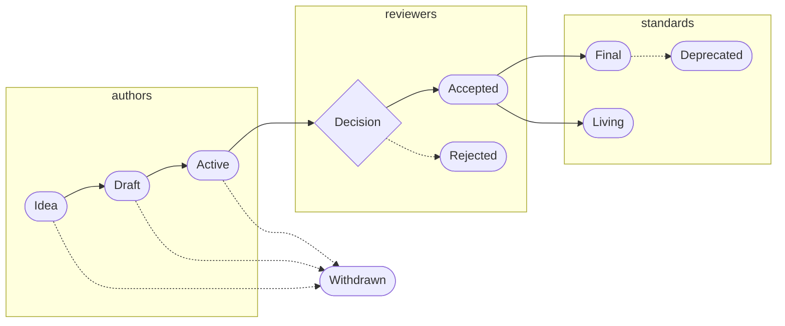

## Overview

Aleo Request for Comments (ARCs) are protocol-level, network-level, and application-level standards for the Aleo ecosystem.

## Topics

ARC standards proposals should be labeled with one of the following categories:
  - `Protocol`: all core features, system parameters, consensus upgrades, and cryptographic protocols
  - `Networking`: all communication protocols, message formats, and RPC standards
  - `Application`: all application-level standards and conventions
  - `Meta`: all informational and general-purpose notices

## Process

`Idea` refers to a proposal that is in the brainstorming phase and is not ready for review.

`Draft` refers to a proposal that is currently undergoing development and is not ready for review.

`Active` refers to a proposal with a reference implementation that is ready for review.

`Withdrawn` refers to a proposal that was previously marked as `Idea`, `Draft`, or `Active`.

`Accepted` refers to a proposal that was `Active` with a reference implementation, and has been approved by reviewer(s).

`Rejected` refers to a proposal that was `Active` with a reference implementation, and has been denied by reviewer(s).

`Final` refers to a proposal that was `Accepted`, and the reference implementation has been incorporated into Aleo. 

`Deprecated` refers to a proposal that has been superseded or replaced by a new proposal that is now marked as `Final`.

`Living` refers to a proposal that was `Accepted` and intended to remain as a living document.

