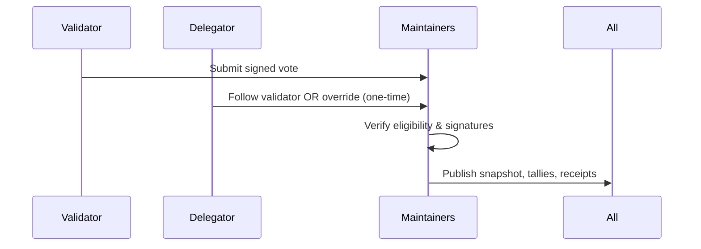
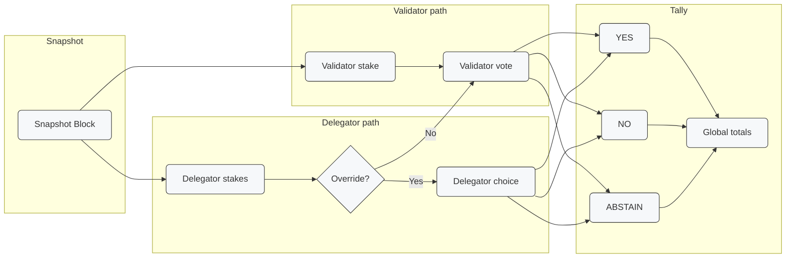

## Abstract
This ARC introduces a standardized, stake-weighted voting framework for Aleo governance. It replaces informal processes with a transparent, auditable system where votes are signed, verified against stake at a fixed snapshot, and results are publicly reproducible.

The design prioritizes simplicity and auditability today, while laying the groundwork for trustless, on-chain voting in the future.  

**Key Principles**
- Parameters (vote window, snapshot height, thresholds) are fixed once a vote opens.  
- Validators sign structured payloads signaling their vote.  
- Delegators automatically follow their validator’s vote but may submit **one override** during the voting window.  
- Final tallies are computed against stake at the snapshot block and published with all artifacts.  

---

## Motivation
Governance on Aleo should be secure, open, and grounded in decisions that can be independently verified. This ARC introduces a governance process that is easy to adopt now, with room to evolve into more advanced designs.

- It ensures decisions reflect real stake.  
- It builds trust by being auditable by anyone.  
- It provides a flexible foundation for future upgrades. 

---

## Specification

### Proposal Lifecycle
1. **Draft** – GitHub Discussion or Issue to collect feedback.  
2. **Formalize** – Submit via GitHub template with required fields.  
3. **Voting Phase** – Validators submit signed votes; delegators may override.  
4. **Snapshot & Tally** – Record stake, tally votes, publish artifacts.  
5. **Finalize** – If passed, execute the action and archive artifacts.

### Proposal Format
Each proposal must include:  

| Field              | Description                                           |
|--------------------|-------------------------------------------------------|
| `proposal_id`      | Unique identifier                                     |
| `voting_window`    | Start and end block heights                           |
| `snapshot_height`  | Block used to lock voting power                       |
| `quorum`           | Minimum participation threshold                       |
| `pass_threshold`   | Stake percentage required to pass                     |
| `domain_string`    | Signature domain (e.g., `aleo-gov-v1`)                |

*All parameters are fixed once voting begins.*  

### Voting Model

#### Roles
| Role                  | Description                                                                 |
|-----------------------|-----------------------------------------------------------------------------|
| **Proposers**         | Submit a proposal using the GitHub template.                     |
| **Validators**        | Identified on-chain; vote off-chain by signing structured payloads.          |
| **Delegators**        | Stake to validators; follow validator’s vote or submit one override.         |
| **Governance Maintainers** | Facilitate: review proposals, run snapshot/tally tools, publish results. |

#### Phases
- **Vote Start** → Voting opens
- **Vote End** → Final vote deadline
- **Snapshot Height** → Locks voting power

### Snapshot Behavior
At the **snapshot height**:

- All bonded validators and their delegations are recorded.  
- Delegators automatically inherit their validator’s vote unless they explicitly override.  
- The snapshot defines **final vote weights** used in tallying.  

### Tallying Process
Final tallies must include:  
- Total stake for **YES / NO / ABSTAIN**  
- Quorum achievement 
- Pass/fail status 
- Validator and delegator vote receipts  
- Signed payloads & snapshot  
- Reproducibility toolkit (CLI/script)  

*Results are published in canonical JSON format to GitHub.*  

---

## Aleo Network Foundation’s Role in Governance
The Aleo Network Foundation participates in governance as any other validator, subject to the same stake-weighted rules. Its vote is guided by internal governance policies and community feedback.

This approach ensures that people who contribute to the network, even if they don’t stake, still have a meaningful way to influence outcomes through the Foundation. The ANF serves as a bridge between community input and the formal, stake-based governance system. Its participation makes the process inclusive while keeping everything transparent and auditable.

By folding ANF’s voting power into this model, we keep things aligned with stake-weighted governance while honoring the values and input of the wider Aleo community.

## Dependencies  

For this ARC to work smoothly, a few things need to be in place:  

- **Validator info at snapshot time** – We need a clear record of validator and delegator stake at the snapshot block height.  
- **Key infrastructure** – Validators should be able to sign structured messages with their validator keys.  
- **Basic tooling** – A lightweight CLI or script is needed to take snapshots, check signatures, and tally results.  
- **GitHub setup** – GitHub Discussions and the ARC template will serve as the official home for proposals and records.  
- **Voting platform** – A place to surface the vote and manage participation (e.g., a simple web interface or dashboard).  

## Backwards Compatibility
This proposal does not change anything at the protocol level.

## Final Remarks
This ARC defines a clear and auditable governance process that can be built on going forward. 

Potential future iterations may:  
- Move vote collection fully on-chain  
- Use zero-knowledge proofs for tally integrity  
- Enable auto-triggering of protocol changes
- Introduce encrypted voting with delayed reveal

*All upgrades can be layered without disrupting current design.*  

This ARC introduces the foundation for validator and delegator responsibilities, defines the timing and mechanics of voting, and sets requirements for publishing key artifacts (including signatures, snapshots, and tallies). Proposals that reach consensus become enforceable outcomes on Aleo under this governance framework.
